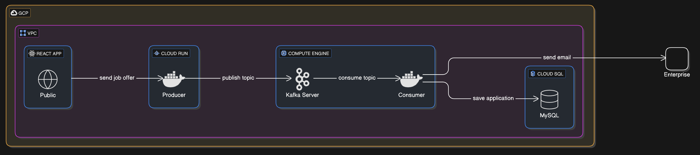
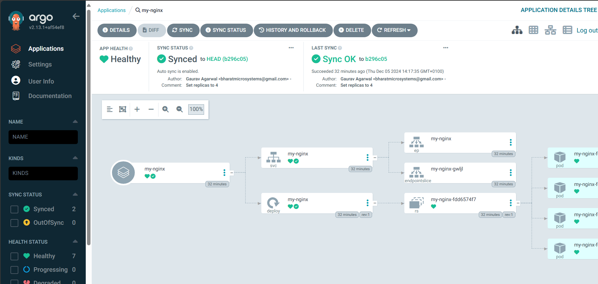

# jobOffer-cloud
this project will deploy job-offer application to the cloud (GCP , Openshift Kubernetes and in local with docker-compose)


## Schema



# GCP Infrastructure Setup with Terraform

This project provides a step-by-step setup for deploying a web application infrastructure on Google Cloud Platform (GCP) using **Terraform**. The infrastructure consists of **Compute Engine** instances for Kafka and the consumer, **Cloud Run** for the React app and producer, **Cloud SQL** for MySQL, and a **VPC** with appropriate firewall rules.

## Infrastructure Overview

- **VPC**: A Virtual Private Cloud (VPC) is created to manage both **private and public subnets** for secure communication between services.
- **Firewall Rules**: Rules are configured to restrict traffic between services, allowing communication only where necessary (e.g., Kafka, MySQL, Cloud Run).
- **Compute Engine**: Kafka brokers and the consumer are hosted on Compute Engine instances.
- **Cloud Run**: The React app and producer are deployed on Cloud Run.
- **Cloud SQL**: MySQL is hosted on Cloud SQL for persistent storage.

## Steps Implemented

### 1. VPC Configuration
The **VPC** is configured with both private and public subnets. The private subnet ensures secure communication between Compute Engine instances, Cloud SQL, and Kafka, while the public subnet is used for Cloud Run services that need public access (e.g., React app).

- **Private Subnet**: For services that do not require external access, such as Kafka brokers and MySQL database.
- **Public Subnet**: For services like Cloud Run (React app and producer) that need to interact with the outside world via HTTP requests.

### 2. Firewall Configuration
Firewall rules are defined based on **tags** for each service:
- **Kafka** and **Producer** are tagged for secure communication between the Kafka brokers, producer, and consumer.
- **MySQL** firewall rules allow MySQL traffic only between Cloud SQL and Compute Engine instances.
- Tags for Cloud Run (React app) ensure that only authorized traffic can reach the services.

**Tags Used**:
- `kafka-server`: Kafka broker instances.
- `producer`: Producer instances.
- `consumer`: Consumer instances.
- `mysql-db`: MySQL Cloud SQL instance.
- `cloud-run`: Cloud Run instances (React and producer).

### 3. Module Separation
To follow best practices:
- The **VPC** and **Firewall** configurations are separated into distinct Terraform files (`vpc.tf` and `firewall.tf`).
- This modular approach allows for easier updates and maintenance of individual components.

### 4. Deployment
- Once the infrastructure components are defined in Terraform, you can deploy them all at once using `terraform apply`.
- The Terraform configuration will create all the resources in one go, applying the VPC setup and firewall rules, followed by the Compute Engine instances, Cloud SQL, and Cloud Run services.

### 5. Deployment


To integrate the Argo CD access instructions into your README, here's a clear and concise section you can use, along with a placeholder for the image:

```markdown
## Accessing the Argo CD Web UI

To access the Argo CD Web UI, you need to retrieve the external IP of the `argocd-server` service:

```bash
kubectl get svc argocd-server -n argocd
```

Example output:

```plaintext
NAME            TYPE           CLUSTER-IP     EXTERNAL-IP     PORT(S)        
argocd-server   LoadBalancer   10.3.240.170   34.136.97.17    80:30188/TCP,443:31372/TCP
```

In this example, Argo CD is accessible at [https://34.136.97.17/](https://34.136.97.17/).

### Logging In

To log in, you need the default admin password. Retrieve it with the following commands:

```bash
# Reset the admin password and restart the Argo CD server
kubectl patch secret argocd-secret -p '{"data": {"admin.password": null, "admin.passwordMtime": null}}' -n argocd
kubectl scale deployment argocd-server --replicas 0 -n argocd
kubectl scale deployment argocd-server --replicas 1 -n argocd

# Wait 2 minutes and retrieve the new password
kubectl -n argocd get secret argocd-initial-admin-secret -o jsonpath="{.data.password}" | base64 -d && echo
```

### UI Preview

Here’s a preview of the Argo CD login screen:


```

### Actions for Completing the README
1. Add an actual screenshot of the Argo CD login page saved locally as `./images/argocd-login.png`.
2. Include a brief note on securing the credentials after logging in for the first time.

## Conclusion
This infrastructure setup follows best practices for networking, security, and modularity using Terraform. The VPC and firewall configurations ensure secure communication between services while allowing for easy scaling and updates in the future.

---

### Notes
- Ensure that all necessary APIs (e.g., Compute Engine, Cloud SQL, Cloud Run, IAM, etc.) are enabled in your GCP account.
- Terraform will handle the deployment of resources in GCP, and you can modify or add configurations based on your future requirements.
- This setup is a foundation for deploying a web application infrastructure on GCP. Additional configurations and services may be required based on your specific application needs.
